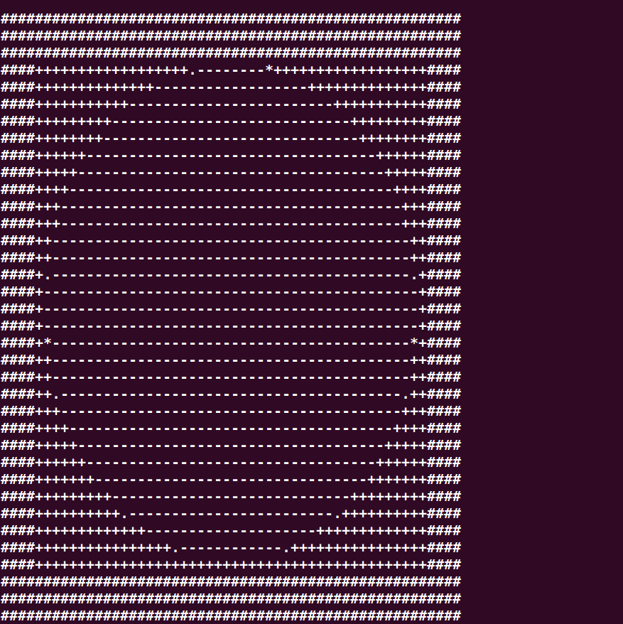

# ascii-art

## Description
This project aims to generate ASCII art from an image using the power of computer vision and array manipulation. By converting the image into a numerical representation based on different threshold regions, symbols are used to recreate the image in the console.

## About this Project
This project utilizes the OpenCV library for image processing and NumPy for array manipulation. The combination of these powerful tools allows for the creation of visually stunning ASCII art representations.

## Usage
To use this project, follow these steps:

1. Clone the repository from [GitHub](https://github.com/Shiny-Akash/python-mini-projects/tree/ascii-art/projects/asciiart).
2. Navigate to the project directory.
3. Run the script `make_art.py` in the command line.
4. Provide the path to the image you want to convert to ASCII art as a command line argument. If no argument is provided, a default sample image will be used.

Example command:
```
python3 make_art.py [image_path]
```

## Customization
There are two aspects of the ASCII art generation that you can customize:

1. `symbols_list`: Modify this list to use different symbols in the generated ASCII art.
2. `threshold_list`: Modify this list to adjust the threshold values and change the patterns in the printed image.

Feel free to experiment with different symbols and threshold values to create unique and personalized ASCII art.

## Sample
Here is an example of the ASCII art generated using this project:

Input Image:


Output:


